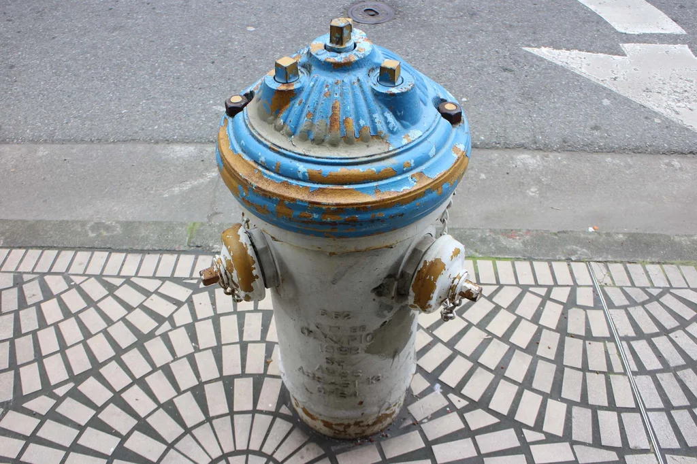
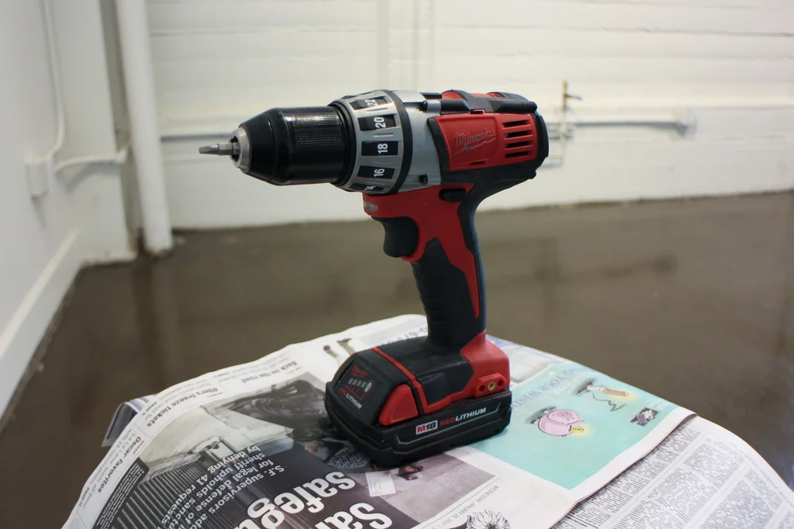

# Instructions for Photogrammetry Video Capture
###### By N. Escobar

## Picking an Object
The object should ideally be something with lots of edges 
and lots of texture.

> The program works by triangulating the points from the 
> different angles in each frame of the video, the more 
> texture and edges the object has, the more information
> the program gets to work with.

Examples of good objects:

> 
> 
> 
> 

Try to avoid objects that are too smooth, like spherical 
or cylindrical objects, as well as objects that are
shiny, reflective, or clear.

> Don't worry if it isn't perfect as long as the object 
> isn't smooth or shiny it should be fine

[Example video (from 0:16-0:37)](https://youtu.be/i8AdX6OCvHg?t=16)