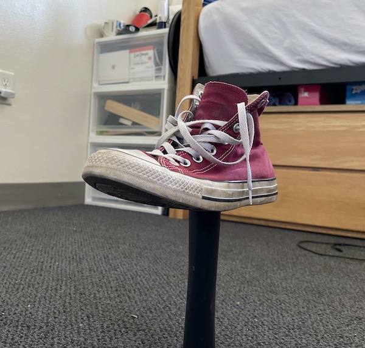

# Instructions for Photogrammetry Video Capture of a Stationary Object
###### By N. Escobar

## Picking an Object
The object should ideally be something with lots of edges 
and lots of texture.

> The photogrammetry software works by triangulating the 
> points from the different angles in each frame of the 
> video. The more texture, edges and patterns the object 
> has, the more information the software gets to work with.
>
> #### Some good objects:
> 
> 
> 
> 
> 

Try to avoid objects that are too smooth, like spherical 
or cylindrical objects, as well as objects that are
shiny, reflective, or clear. Objects that are uniformly 
one color are also an issue. Objects that would move 
around a lot (i.e. alive) aren't ideal, especially if they
cannot actually hold perfectly still.

> Don't worry if it isn't perfect, it can have small smooth 
> or shiny parts as long as the object as a whole isn't 
> *too* bad.
>
> #### Some bad objects:
> 
> 
> 
> 

## Capture Setup

### Backdrop

Because we don't have a fancy turntable studio setup, we'll
be capturing the object by walking around it. To get the best
result, choose a spot that has a complex, stationary 
backdrop for your capture.

> Just like with picking your object, giving the backdrop
> more edges, texture and patterns gives the software more 
> information.
> 
> Good backdrops would be something like a backyard or a
> room with a lot of furniture. Just make sure there's a
> large enough space around the object to walk all the way
> around.
> 
> Bad backdrops would be rooms with lots of clear space and
> little furniture, or lots of flat, especially white, surfaces. 
> Also avoid someplace busy that people would walk through or 
> that would change while capturing. An empty room with white 
> walls and a dog wandering around would be a bad choice.

### Lighting

It's important to make sure the object is well, and 
consistently, lit. The object should be lit from all sides,
ideally with the same intensity on all sides. Slight
variations are fine and inevitable, but you want to avoid
casting shadows, especially harsh ones or ones that move, 
on your object. Try to use diffused light on your object
rather than intense, focused light.

> #### Lighting tips:
> - avoid bright spots behind your object from things like
lights, uncovered windows, or bright sky
> - don't use your camera's flash, it will cast moving shadows
on your object
> - if you choose to light your object with external lights, 
make sure they are stationary and your object is still lit 
evenly on all sides; this will likely  require multiple lights,
especially without a way to diffuse it
> - a subtly overcast day outdoors provides ideal lighting 
conditions
>  
>  

### Positioning
You want the item isolated and clear of things immediately
around it. And remember, you want to be able to walk all the 
way around it and see every part of the object.

Ideally, you'd put the item on some kind of post or stand. 
The post should be small and simple. If your object can't be 
positioned like that, try to put it on a small, flat table or
pedestal.

> #### Positioning Examples:
> 
> 
> 
> 

## Capturing

The exciting bit! Now that your object is ready, you can
finally start capturing it. Almost -- just make sure your
phone is set to capture video at the highest quality.

> On iOS devices, this is found in the `Settings app > 
> Camera > Record Video`\
> If it's available, set the first option to `4K at 60 fps`
> 
> If you know how, set the exposure and white balance on your
> camera to manual, set them and leave them. Otherwise, you're 
> ready to start shooting.

The idea here is to walk around your object, taking a *single* 
video to get coverage of the entire thing. You can use either
portrait or landscape modes, whichever helps frame your object
better. Make sure the object is centered and focused for the
entire video.

[^1]

> You want to walk 360º around the object, taking passes at 
> different heights and angles (emphasis on *and*) like in
> `fig 1.1` and `fig 1.2`.
> 
> In the end, you should have shots in the video forming 
> something like the sphere shape in `fig 1.3`.
> 
> 
> ###### `fig 1.1` *(left)* and `fig 1.2` *(right)*[^alpha]
>
>  
>
> 
> ###### `fig 1.3`[^beta]

[^2]

After you do the passes around, make sure you get above and below the 
object to capture the top and bottom, and around any corners or folds
to ensure everything has been captured and to get more granular detail.

> You should gradually bring the camera closer to the object, getting
> clearer shots of details and things that the camera missed in other 
> passes. Just don't get too close too fast, or it will confuse the 
> software.

[^1]

> #### Capture tips:
> - keep the camera at a consistent distance as you make your passes
>   - your object should fill most of the frame, but you should still 
      capture some background and  try to make sure the entire object 
      is in frame
> - keep the camera steady and smooth, don't make any sudden moves or
>   point the camera away from the object
> - videos should only be about **one minute** -- each frame has a lot of 
    information
> - you should take a few different videos where you walk in different 
    patterns to give the software the best chance to get a complete
    scan

## Samples

Watch this sample scan to get an idea of what your video should look like:

> [**Sample Scan**](https://player.vimeo.com/video/628471220?h=8254701244) (also at [`sample/sampleVideo.mp4`](https://github.com/nickesc/PhotogrammetryVideoInstructions/blob/main/sample/sampleVideo.mp4))

And to get an idea of what the final product will look like after processing,
you can watch this short render from that sample scan

> [**Sample Render 4K**](https://player.vimeo.com/video/630037720?h=33217a9381) (also at [`sample/sampleRender.mov`](https://github.com/nickesc/PhotogrammetryVideoInstructions/blob/main/sample/sampleRender.mov))
>

In the [`sample/`](https://github.com/nickesc/PhotogrammetryVideoInstructions/blob/main/sample) 
directory, you'll also find [`samplePointCloud.ply`](https://github.com/nickesc/PhotogrammetryVideoInstructions/blob/main/sample/samplePointCloud.ply),
which holds the point cloud made from the video by the photogrammetry 
software. This can be viewed with a `*.ply` viewer, and you can explore 
the point cloud if you cannot make one yourself.

References[^a][^b][^c][^d]

[^a]: [Shooting for Photogrammetry](https://www.instructables.com/Shooting-for-Photogrammetry/)
[^b]: [3D scan with a phone: Our best tips](https://www.sculpteo.com/en/3d-learning-hub/best-articles-about-3d-printing/3d-scan-smartphone/)
[^c]: [Getting Started with Photogrammetry: Part 2 — Interior Scanning](https://medium.com/realities-io/getting-started-with-photogrammetry-part-2-f957c9e8d61d)
[^d]: [Getting started with Photogrammetry — with a Smartphone camera \[2019\]](https://medium.com/realities-io/getting-started-with-photogrammetry-d0a6ee40cb72)

[^1]: [3D Scanning from video with Reality Capture](https://www.youtube.com/watch?v=i8AdX6OCvHg)
[^2]: [How to 3D Photoscan Easy and Free!](https://www.youtube.com/watch?v=k4NTf0hMjtY)

[^alpha]: [`fig 1.1` and `fig 1.2` source](https://www.3dscanstore.com/blog/3d-scanning-reflective-objects)
[^beta]: [`fig 1.3` source](https://www.vistable.com/photogrammetry-or-photo-modeling-for-the-digital-factory-model/)

