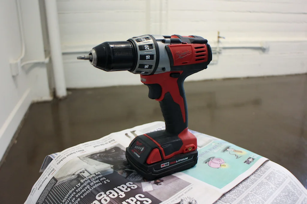

# Instructions for Photogrammetry Video Capture of a Stationary Object
###### By N. Escobar

## Picking an Object
The object should ideally be something with lots of edges 
and lots of texture.

> The photogrammetry software works by triangulating the 
> points from the different angles in each frame of the 
> video. The more texture and edges the object has, the 
> more information the software gets to work with.

Examples of good objects:

> 
> 
> 
> 

Try to avoid objects that are too smooth, like spherical 
or cylindrical objects, as well as objects that are
shiny, reflective, or clear. Objects that are uniformly 
one color are also an issue. Objects that would move 
around a lot (i.e. alive) aren't ideal, especially if they
cannot actually hold perfectly still.

> Don't worry if it isn't perfect, it can have small smooth 
> or shiny parts as long as the object as a whole isn't 
> *too* bad.

Examples of bad objects:

> 
> 
> 

## Capture Setup

### Backdrop

Because we don't have a fancy turntable studio setup, we'll
be capturing the object by walking around it. To get the best
result, choose a spot that has a complex, stationary 
backdrop for your capture.

> Just like with picking your object, giving the backdrop
> more edges and texture gives the software more information.
> 
> Good backdrops would be something like a backyard or a
> room with a lot of furniture. Just make sure there's a
> large enough space around the object to walk all the way
> around.
> 
> Bad backdrops would be rooms with lots of clear space and
> little furniture, or lots of flat, especially white, surfaces. 
> Also avoid someplace busy that people would walk through or 
> that would change while taking the capture. An empty room 
> with white walls and a dog wandering around would be a bad 
> choice.

### Lighting

It's important to make sure the object is well, and 
consistently, lit. The object should be lit from all sides,
ideally with the same intensity on all sides. Slight
variations are fine and inevitable, but you want to avoid
casting shadows, especially harsh ones or ones that move, 
on your object. Try to use diffused light on your object
rather than intense, focused light.

> Tips:
> - avoid bright spots behind your object from things like
lights, uncovered windows, or bright sky
> - don't use your camera's flash, it will cast moving shadows
on your object
> - if you choose to light your object with external lights, 
make sure they are stationary and your object is still lit 
evenly on all sides; this will require multiple lights
> - a subtly overcast day outdoors provides ideal lighting 
conditions
>  
>  

### Positioning
You want the item isolated and clear of things immediately
around it. And remember, you want to be able to walk all the 
way around it and see every part of the object.

Ideally, you'd put the item on some kind of post or stand. 
The post should be small and simple. If your object can't be 
positioned like that, try to put it on a small, flat table or
pedestal.

>
>

## Shooting

[Example video (from 0:16-0:37)](https://youtu.be/i8AdX6OCvHg?t=16)

[Example video 2 (from 5:04-5:32)](https://youtu.be/k4NTf0hMjtY?t=304)

References[^a][^b] [^2][^3]

[^a]: https://www.instructables.com/Shooting-for-Photogrammetry/
[^b]: https://www.sculpteo.com/en/3d-learning-hub/best-articles-about-3d-printing/3d-scan-smartphone/

[^2]: https://www.youtube.com/watch?v=i8AdX6OCvHg
[^3]: https://www.youtube.com/watch?v=k4NTf0hMjtY
